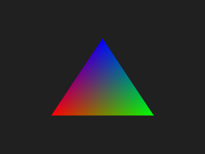
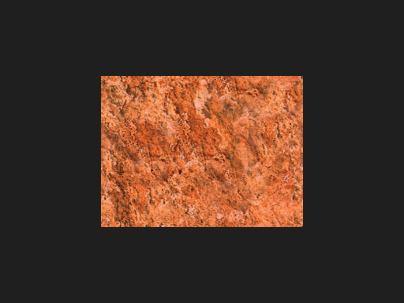
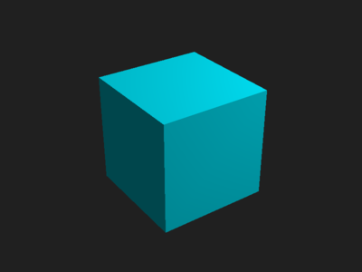

Examples
########

:summary: Examples for the Python bindings.
:ref-prefix:
    corrade
    magnum

.. contents::
    :class: m-block m-default

The :gh:`magnum-examples <mosra/magnum-examples>` repository contains a few
examples in pure Python in the ``src/python/`` directory. These currently
mirror the :dox:`C++ examples <example-index>` and show how to achieve the same
in Python.

`Your First Triangle`_
======================

Basic rendering with builtin shaders. Fully equivalent to
:dox:`the C++ version <examples-triangle>`.

.. include:: ../../src/python/magnum-triangle.py
    :code: py
    :start-line: 31

`Textured Quad`_
================

Importing image data, texturing and custom shaders. Fully equivalent to
:dox:`the C++ version <examples-texturedquad>`.

.. include:: ../../src/python/magnum-texturedquad.py
    :code: py
    :start-line: 31

`Primitives`_
=============

Importing mesh data, 3D transformations and input handling. Equivalent to
:dox:`the C++ version <examples-primitives>` except that it uses
:ref:`meshtools.compile()` instead of interleaving the data by hand --- the
low-level :dox:`MeshTools` APIs are not exposed yet.

.. include:: ../../src/python/magnum-primitives.py
    :code: py
    :start-line: 31

`Primitives, using a scene graph`_
----------------------------------

Same behavior as above, but this time handling transformations using the scene
graph. Compared to doing the same in C++ there's less worrying about data
ownership, as the reference counting handles most of it.

.. include:: ../../src/python/magnum-primitives-scenegraph.py
    :code: py
    :start-line: 31

`Model viewer`_
===============

Scene graph, resource management and model importing. Goal is to be equivalent
to :dox:`the C++ version <examples-viewer>` except that right now it imports
the meshes directly by name as the full scene hierarchy import APIs from
:dox:`Trade::AbstractImporter` are not exposed yet.

.. include:: ../../src/python/magnum-viewer.py
    :code: py
    :start-line: 31
