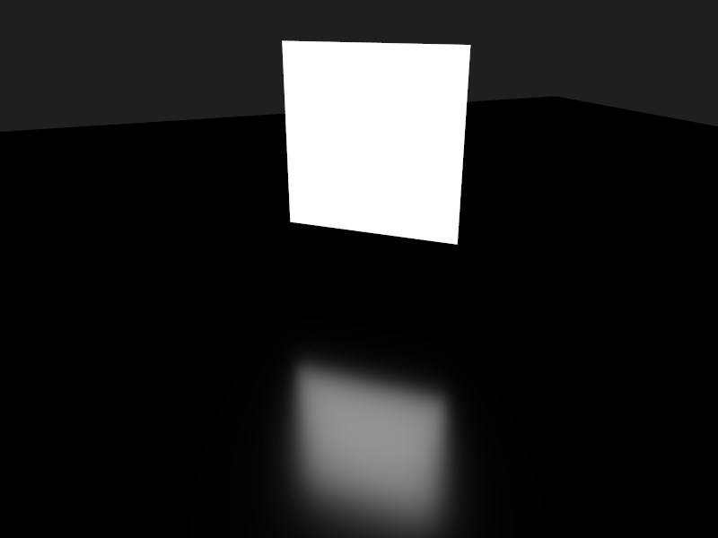

This example is a basic implementation of Eric Heitz et. al paper ["Real-Time Polygonal-Light Shading with Linearly Transformed Cosines"](https://eheitzresearch.wordpress.com/415-2/).
It displays an untextured rectangular area light and a ground plane.

Key shortcuts
-------------

W/A/S/D - Move camera

Left drag - Look around

(Shift+)R - (De-/)increase roughness of plane

(Shift+)M - (De-/)increase metalness of plane

(Shift+)F - (De-/)increase f0 of plane

F5 - Reload shaders.
