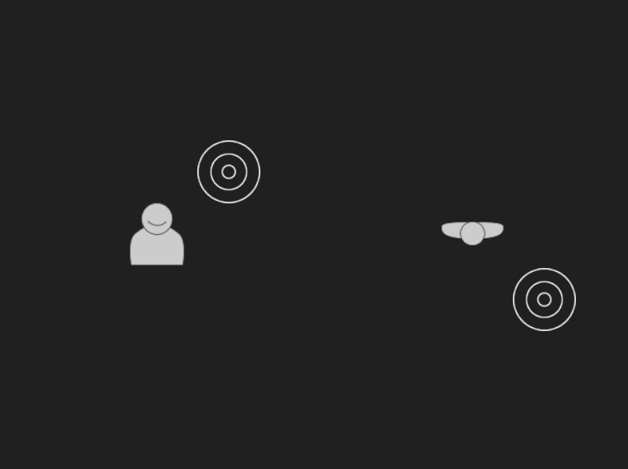

This example shows how to play spatialized audio with magnum.
The audio scene includes a 3D sound source and a (default) listener, which are visualized in a 2D top and front view.
The sound source can be moved around the listener by clicking on the screen.

Key shortcuts
-------------

**Left-click**: Set sound source position.
