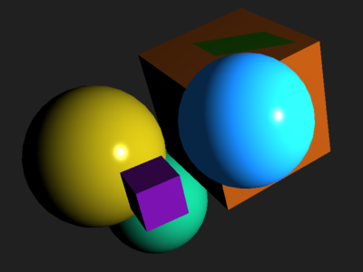

This example demonstrates usage of multiple framebuffer attachments to
implement object picking. One attachment is used for color output, the other
contains object IDs. The color buffer is blit to window framebuffer, a pixel
from the other is read after mouse click to retrieve object ID. Requires OpenGL
3.3+.

Key controls
------------

Use **mouse drag** to rotate the scene, **mouse click** to highlight particular
object.
