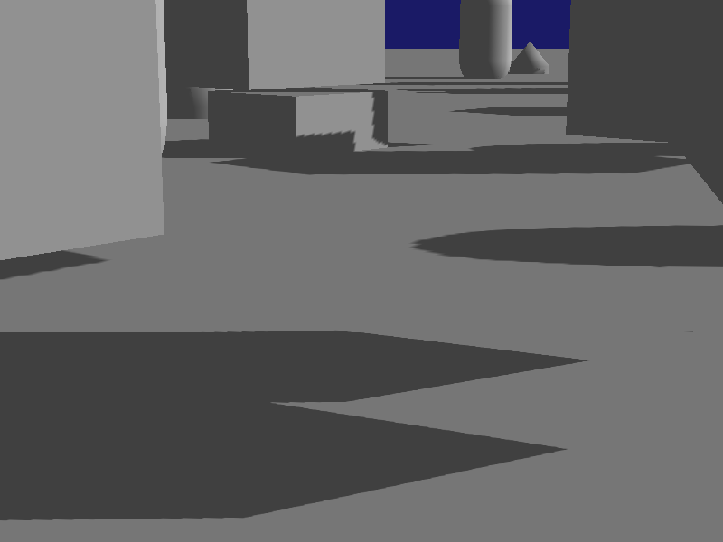
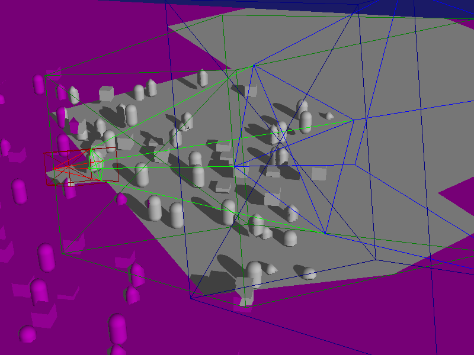

Shadow Map Example
------------------

This is an example of shadow mapping using a Parallel Split / Cascade shadow
mapping technique with a single, directional light source.

It is intended to be a basis to start including your own shadow mapping system
in your own project.

Keyboard Controls
-----------------

### Movement/view

-   **Cursor keys** and **Page Up** / **Page Down** -- translate camera
-   **Mouse drag** -- rotate the camera
-   **F1** -- switch to main camera
-   **F2** -- switch to debug camera

### Shadow configuration changes -- watch the console output for changes

-   **F3** -- change shadow face culling mode
-   **F4** -- shadow map alignment (camera/static)
-   **F5** / **F6** -- change layer split exponent
-   **F7** / **F8** -- tweak bias
-   **F9** / **F10** -- change number of layers
-   **F11** / **F12** -- change shadow map resolution

Credits
-------

This example was originally contributed by [Bill Robinson](https://github.com/wivlaro).
