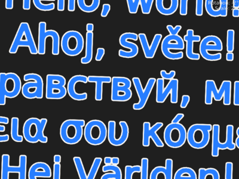

Showcase of Magnum distance-field text rendering. Instead of rendering the
glyphs for each size the glyphs are prerendered and converted into signed
distance field texture. The texture is then used for rendering the text. Both
glyph prerendering and the actual text layouting supports UTF-8. For mutable
text, buffer mapping is used.

Usage
-----

**Mouse wheel** rotates and scales the text.

Font license
------------

This example uses `DejaVuSans.ttf` font from [DejaVu Project](dejavu-fonts.org).
