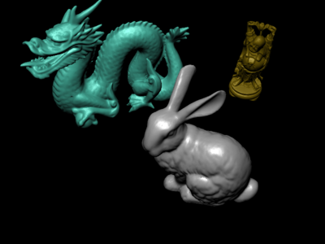

This is simply an viewer for COLLADA files. It can load scenes with one or
more objects and display them. COLLADA support is currently aimed at opening
files exported from Blender 2.6. Only triangle meshes with Phong shading
without textures are currently supported.

Usage
-----

Pass path to COLLADA file as parameter:

    ./viewer ~/models/scene.dae

The application opens the file and displays the scene. The meshes are
optimized for faster viewing. Import progress is written to console output.

Mouse and key shortcuts
-----------------------

 * **Arrow keys** or **mouse drag** rotate the camera around the scene.
 * **Page Up** and **Page Down** or **mouse wheel** zooms in and out.
 * **Home** toggles between wireframe and shaded view (not available on OpenGL
   ES).
